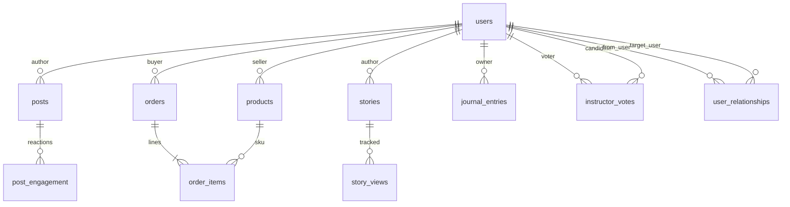

# Entity Relationship Diagram (ERD) - Growl App Database

## Database Schema Overview

This document describes the Entity Relationship Diagram for the Growl app database using Cloudflare D1 (SQLite).

### Mermaid (conceptual)

Physical DDL is applied via `backend/migrations/` (including **`0003_user_relationships_friend_types.sql`**, which rebuilds `user_relationships` so `type` can be `friend` or `friend_request`).



**Category cohort “friends by default”** is logical: there is no `cohorts` table. After onboarding picks are saved (`users.metadata.categories`), the API expands cohort keys (e.g. `art:violin` ⇒ `art:violin` + `art`) and creates reciprocal **`friend`** rows between users whose expanded sets intersect.

## Entities and Relationships

```
┌─────────────────────────────────────────────────────────────────────────────┐
│                              GROWL DATABASE ERD                              │
└─────────────────────────────────────────────────────────────────────────────┘

┌──────────────┐
│    users     │
├──────────────┤
│ id (PK)      │◄─────┐
│ email (UQ)   │      │
│ password_hash│      │
│ points       │      │
│ is_instructor│      │
│ is_business  │      │
│ metadata     │      │
│ created_at   │      │
│ updated_at   │      │
└──────────────┘      │
                      │
         ┌────────────┼────────────┐
         │            │            │
         │            │            │
    ┌────▼────┐  ┌────▼────┐  ┌───▼────┐
    │  posts  │  │products │  │ orders │
    ├─────────┤  ├─────────┤  ├────────┤
    │ id (PK) │  │ id (PK) │  │ id (PK)│
    │user_id  │  │user_id  │  │user_id │
    │(FK)     │  │(FK)     │  │(FK)    │
    │image_url│  │name     │  │status  │
    │caption  │  │desc     │  │total   │
    │category │  │category │  │shipping│
    │subcat   │  │subcat   │  │address │
    │eng_score│  │price    │  │metadata│
    │metadata │  │stock    │  │created │
    │created  │  │image_url│  │updated │
    │updated  │  │images   │  └───┬────┘
    └────┬────┘  │metadata │      │
         │       │created  │      │
         │       │updated  │      │
         │       └─────────┘      │
         │                        │
    ┌────▼──────────┐        ┌────▼─────────┐
    │post_engagement│        │ order_items  │
    ├───────────────┤        ├──────────────┤
    │ id (PK)       │        │ id (PK)      │
    │ post_id (FK)  │        │ order_id (FK)│
    │ user_id (FK)  │        │ product_id   │
    │ type          │        │   (FK)       │
    │ content       │        │ quantity     │
    │ created_at    │        │ price        │
    └───────────────┘        │ created_at   │
                              └──────────────┘

┌──────────────────────┐
│ user_relationships   │
├──────────────────────┤
│ id (PK)              │
│ user_id (FK)         │──┐
│ target_user_id (FK)  │──┤──► users (self-reference)
│ type                 │  │
│ created_at           │  │
│ UNIQUE(user_id,      │  │
│        target_user_id,│  │
│        type)         │  │
└──────────────────────┘  │

┌──────────────────────┐
│ instructor_votes     │
├──────────────────────┤
│ id (PK)              │
│ user_id (FK)         │──┐
│ candidate_id (FK)    │──┼──► users (self-reference)
│ created_at           │  │
│ UNIQUE(user_id,      │  │
│        candidate_id) │  │
└──────────────────────┘  │

┌──────────────────────┐
│      reports         │
├──────────────────────┤
│ id (PK)              │
│ reporter_id (FK)     │──► users
│ target_id            │
│ target_type          │
│ reason               │
│ status               │
│ created_at           │
└──────────────────────┘

┌──────────────────────┐
│  journal_entries     │
├──────────────────────┤
│ id (PK)              │
│ user_id (FK)         │──► users
│ title                │
│ content              │
│ mood                 │
│ tags                 │
│ is_public            │
│ metadata             │
│ created_at           │
│ updated_at           │
└──────────────────────┘
```

## Entity Descriptions

### 1. users
**Primary Key:** `id`  
**Unique Constraints:** `email`

Core user entity storing authentication and profile information.

**Relationships:**
- One-to-Many with `posts` (user creates posts)
- One-to-Many with `products` (business user creates products)
- One-to-Many with `orders` (user places orders)
- One-to-Many with `post_engagement` (user likes/comments)
- Self-referential via `user_relationships` (follows, blocks, mutes, friends)
- Self-referential via `instructor_votes` (users vote for instructors)
- One-to-Many with `journal_entries` (user creates journal entries)

### 2. posts
**Primary Key:** `id`  
**Foreign Keys:** `user_id` → `users.id`

User-generated content posts with categories and engagement tracking.

**Relationships:**
- Many-to-One with `users` (post belongs to user)
- One-to-Many with `post_engagement` (post has likes/comments)

### 3. post_engagement
**Primary Key:** `id`  
**Foreign Keys:** 
- `post_id` → `posts.id`
- `user_id` → `users.id`

Tracks likes and comments on posts.

**Relationships:**
- Many-to-One with `posts` (engagement belongs to post)
- Many-to-One with `users` (engagement by user)

### 4. products
**Primary Key:** `id`  
**Foreign Keys:** `user_id` → `users.id`

Business inventory items for marketplace.

**Relationships:**
- Many-to-One with `users` (product belongs to business user)
- One-to-Many with `order_items` (product in orders)

### 5. orders
**Primary Key:** `id`  
**Foreign Keys:** `user_id` → `users.id`

Customer orders from marketplace.

**Relationships:**
- Many-to-One with `users` (order belongs to customer)
- One-to-Many with `order_items` (order contains items)

### 6. order_items
**Primary Key:** `id`  
**Foreign Keys:**
- `order_id` → `orders.id`
- `product_id` → `products.id`

Individual items within an order.

**Relationships:**
- Many-to-One with `orders` (item belongs to order)
- Many-to-One with `products` (item references product)

### 7. user_relationships
**Primary Key:** `id`  
**Foreign Keys:**
- `user_id` → `users.id`
- `target_user_id` → `users.id`
**Unique Constraint:** `(user_id, target_user_id, type)`

Directed edges between two user IDs. **`type`** values (after migration 0003): `follow`, `block`, `mute`, **`friend`**, **`friend_request`**.

**Relationships:**
- Many-to-One with `users` (relationship from user)
- Many-to-One with `users` (relationship to target user)

Friendships use **`type = 'friend'`** in **both directions** (`user_id` ⇄ `target_user_id`) for simple symmetry unless/until you normalize to a single canonical edge.

### 8. instructor_votes
**Primary Key:** `id`  
**Foreign Keys:**
- `user_id` → `users.id`
- `candidate_id` → `users.id`
**Unique Constraint:** `(user_id, candidate_id)`

Votes for instructor candidates.

**Relationships:**
- Many-to-One with `users` (voter)
- Many-to-One with `users` (instructor candidate)

### 9. reports
**Primary Key:** `id`  
**Foreign Keys:** `reporter_id` → `users.id`

User reports for content moderation.

**Relationships:**
- Many-to-One with `users` (reporter)

### 10. journal_entries
**Primary Key:** `id`  
**Foreign Keys:** `user_id` → `users.id`

Personal journal entries with mood tracking.

**Relationships:**
- Many-to-One with `users` (entry belongs to user)

### 11. stories
**Primary Key:** `id`  
**Foreign Keys:** `user_id` → `users.id`  

Ephemeral story posts (`migration 0002_add_stories.sql`): media URL, optional caption, optional expiry.

### 12. story_views
**Primary Key:** `id`  
**Foreign Keys:** `story_id` → `stories.id`, `user_id` → `users.id`  
**Unique:** `(story_id, user_id)`

Tracks which viewer saw which story.

## Indexes

For performance optimization, the following indexes are created:

- `idx_posts_user_id` on `posts(user_id)`
- `idx_posts_category` on `posts(category)`
- `idx_posts_created_at` on `posts(created_at)`
- `idx_post_engagement_post_id` on `post_engagement(post_id)`
- `idx_post_engagement_user_id` on `post_engagement(user_id)`
- `idx_products_user_id` on `products(user_id)`
- `idx_orders_user_id` on `orders(user_id)`
- `idx_order_items_order_id` on `order_items(order_id)`
- `idx_user_relationships_user_id` on `user_relationships(user_id)`
- `idx_user_relationships_target_user_id` on `user_relationships(target_user_id)` (migration 0003)
- `idx_user_relationships_type` on `user_relationships(type)` (migration 0003)
- `idx_stories_user_id` on `stories(user_id)`
- `idx_stories_created_at` on `stories(created_at)`
- `idx_story_views_story_id` on `story_views(story_id)`
- `idx_story_views_user_id` on `story_views(user_id)`
- `idx_journal_entries_user_id` on `journal_entries(user_id)`

## Data Types

- **TEXT**: Used for IDs, emails, strings, JSON metadata
- **INTEGER**: Used for booleans (0/1), counts, points
- **REAL**: Used for prices, decimal values
- **Timestamps**: Stored as TEXT in ISO format using `datetime('now')`

## Notes

1. **Cascade Deletes**: All foreign keys use `ON DELETE CASCADE` to maintain referential integrity
2. **Metadata Fields**: JSON metadata stored as TEXT for flexibility
3. **Boolean Fields**: Stored as INTEGER (0/1) for SQLite compatibility
4. **Unique Constraints**: Prevent duplicate relationships and votes
5. **Engagement Score**: Calculated field based on likes and comments
